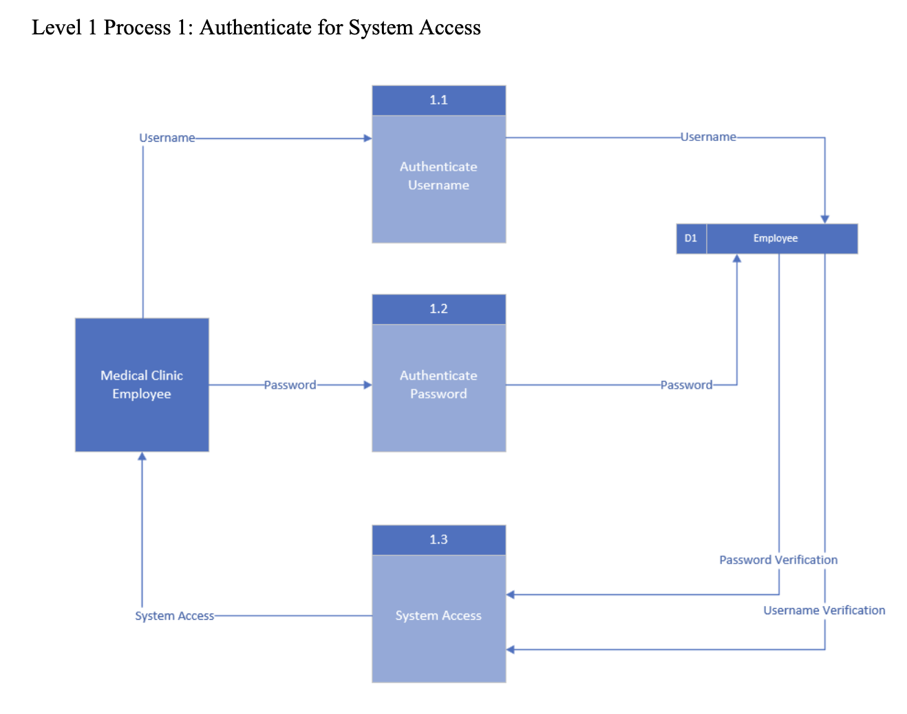
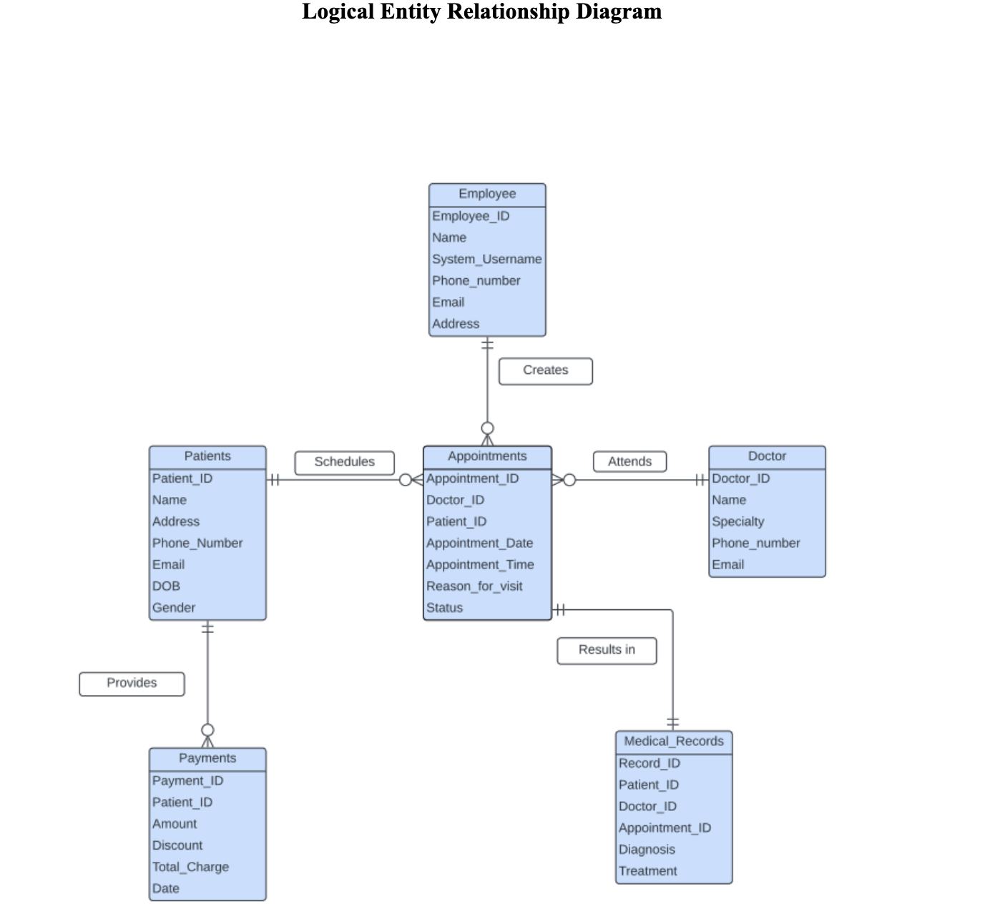

# hospital-appointment-system-sql
Hospital Appointment System (SQL & Systems Analysis Case Study)

This project presents the design of a SQL-based hospital appointment system developed to streamline clinic operations, reduce administrative errors, and improve patient care workflows. The system replaces manual and fragmented processes with a structured relational database that manages patients, appointments, doctors, employees, payments, and medical records.

The project follows a systems analysis and design approach, emphasizing database modeling, requirements definition, use cases, and process flows rather than full application deployment.

## Overview

The system is designed as an internal tool used by hospital staff to manage patient information, schedule and modify appointments, track doctor availability, record payments, and securely retrieve medical records.

The database design prioritizes data integrity, normalization, and scalability while supporting real-world hospital workflows and administrative needs.

The complete system proposal and documentation can be viewed here: [Gee-1 Appointment System Project](Gee-1 Appointment System Project.pdf)

---

## System Objectives

- Centralize patient, appointment, and medical record data  
- Reduce scheduling conflicts and administrative errors  
- Improve efficiency in appointment booking and modifications  
- Support secure handling of patient and medical information  
- Enable reporting and historical data analysis  

---

## Key System Components

**Patient Management**  
Stores patient demographic information and medical history.

**Appointment Management**  
Handles appointment creation, viewing, modification, and cancellation.

**Doctor Availability**  
Tracks doctor schedules to prevent conflicts and improve scheduling accuracy.

**Employee Access**  
Supports authenticated staff interaction with the system.

**Payments and Medical Records**  
Tracks billing information and links medical records to appointments.

---

## Use Cases

- Authenticate for System Access  
- Create Patient Account  
- Update Patient Account  
- View Patient Account  
- Book New Appointment  
- View Appointment  
- Modify Appointment  
- Cancel Appointment  
- Check Doctor Availability  
- Retrieve Medical Records  

Each use case includes defined actors, triggers, preconditions, postconditions, and exception handling.

---

## Process and Data Modeling

### Data Flow Diagrams (DFDs)

**Context-Level DFD**  
Shows system boundaries and external interactions.

**Level 0 DFD**  
Illustrates the primary processes of the hospital appointment system.

**Level 1 DFD – Authentication**  
Details the authentication workflow for system access.

---

### Entity Relationship Diagrams (ERD)

**Logical ERD**  
Models relationships between patients, doctors, appointments, payments, and medical records.

**Physical ERD**  
Displays table structures, attributes, and primary/foreign key constraints.

---

## Database Design

The SQL schema models the following core entities:

- Employees  
- Patients  
- Doctors  
- Appointments  
- Payments  
- Medical Records  

The database is normalized to reduce redundancy and enforce referential integrity using primary and foreign key constraints. SQL schema and sample data are included in the `hospital-appointment-sql-schema` directory.

---

## User Interface Prototypes

Although the focus of this project is backend and database design, UI mockups were created to visualize system navigation and user workflows.

**Home Page Prototype**

**Book Appointment Screen**

---

## Deliverables Included

- Full project documentation (PDF)  
- SQL database schema and sample data  
- Data Flow Diagrams (DFDs)  
- Entity Relationship Diagrams (ERDs)  
- User interface mockups  

---

## Tools and Skills

- SQL and relational database design  
- Systems analysis and design  
- Requirements gathering  
- Data flow modeling (DFDs)  
- Entity relationship modeling (ERD)  
- Database normalization  
- Business process analysis  

---

## Reflection

This project strengthened my ability to analyze healthcare workflows and translate operational requirements into structured database designs. It reinforced the importance of clean schemas, clear documentation, and data integrity when building scalable enterprise systems.
